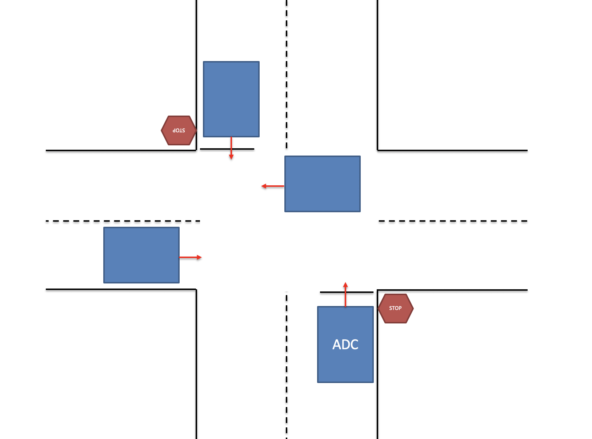
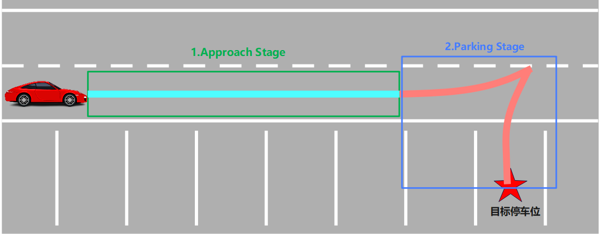

# planning-planner-public-road

## 介绍

`planning-planner-public-road` 是包含PublicRoadPlanner的插件包，PublicRoadPlanner是开放道路规划器，是planning默认使用的规划器，基于场景机制进行规划。

### 场景机制

planning模块从apollo 3.5开始使用了双层状态机的场景机制，相比于apollo 3.0之前的版本，每个驾驶用例都被当作不同的驾驶场景，现在在特定场景中报告的问题可以在不影响其他场景的工作的情况下得到修复，其中问题修复不会影响其他驾驶用例。


双层状态机的Top Layer是Scenario状态机，BottomLayer是Stage状态机。在Top Layer中进行场景切换，ScenarioManager根据周围的环境和地图信息，决定需要切换到哪个场景，如LaneFollow沿道路行驶的场景，PullOver靠边停车的场景。在Bottom Layer中进行Stage的切换，如果上个Stage已经执行完成，继续执行下一个Stage。如果所有的Stage都执行完毕，认为当前Scenario也执行完毕。

目前planning支持以下几种场景：

- **apollo::planning::LaneFollowScenario**: 道保持场景，是默认的自动驾驶场景，在这个场景中车辆沿着路由线路行驶，遇到障碍物根据情况在当前车道线内绕行，或者借道到相邻的车道绕行，并根据routing中的路线信息换道行驶。对道路上的交通标志，如停止，让行标志，人行道或减速带等，根据交通规则进行减速或停止让行。


- **apollo::planning::PullOverScenario**: 边停车场景，如果参数配置 `enable_pull_over_at_destination` 设置为 `true`, 当车辆到达终点附近时，将自动切入 `PullOverScenario` 并完成靠边停车。


- **apollo::planning::BareIntersectionUnprotectedScenario**: 保护交通路口场景，在交通路口既没有停止标志，也没有交通灯，车辆在路口前一段距离范围内切换到此场景。


- **apollo::planning::TrafficLightProtectedScenario**: 保护的交通灯路口场景，在这种路口对前行，左转，右转都有明确的交通灯指示。


- **apollo::planning::TrafficLightUnprotectedLeftTurnScenario**: 保护的交通灯左转，这种场景下，车辆在交通灯路口左转时，仍然会有对向车辆通过路口，这时车辆需要让行。所以TrafficLightUnprotectedLeftTurnScenario场景设计思路与有保护交通灯的区别是，在通过交通路口时，需要增加减速慢行阶段（Creep），以便观察对向车辆，并根据情况让行。


- **apollo::planning::TrafficLightUnprotectedRightTurnScenario**: 保护的交通灯右转，这种场景下，车辆在交通灯右转时，可能会有对向车辆通过，这时车辆需要缓行，并观察红绿灯情况，在安全的前提下右转。


- **apollo::planning::StopSignUnprotectedScenario**: 保护停止标志路口场景，这种场景下的路口，只有一个双向停止标志，车辆在通过路口前，需要观察路口来往车辆，在路口通行车辆密度较小时才通过路口。




<center>双向停止标志路口</center>


<center>四向停止标志路口</center>

- **apollo::planning::YieldSignScenario**: 口有让行标志的场景，在车辆遇到让行标志时，对向有车辆时，要先让对向车辆先行。


- **apollo::planning::ValetParkingScenario**: 车入库的场景，当planning的输入命令RoutingResponse中包含了parking_id的信息时，即是指定将车辆泊入地图中parking_id对应的停车位中。



- **apollo::planning::EmergencyPullOverScenario**: 急停车场景，车辆在行驶过程中如果收到PadMessage命令“PULL_OVER”，车辆就近找到合适的位置在当前车道内停车，相比于直接停止，这样保证了行驶过程中的停车安全。


- **apollo::planning::ParkAndGoScenario**: 辆靠边停车后，从当前位置起步向指定的下一个目标行驶的命令，这种场景适用于巴士接驳的情况。场景中使用了Open Space的算法，保证车辆能够安全从指定位置泊出。


## 目录结构

```shell

modules/planning/planner/public_road
├── public_road
    ├── conf                        // 配置文件
    ├── docs                        // 说明文档
    ├── proto                       // 配置定位文件
    ├── public_road_planner.h       // PublicRoadPlanner头文件
    ├── public_road_planner.cc      // PublicRoadPlanner源文件
    ├── scenario_manager.h          // 场景管理类头文件
    ├── scenario_manager.cc         // 场景管理类源文件
    ├── public_road_planner_test.cc // 单元测试文件
    ├── BUILD                       // 构建规则文件
    ├── cyberfile.xml               // 包管理配置文件
    ├── plugins.xml                 // 插件描述说明文件
    └── README_cn.md                // 说明文档
```
## 插件

### PublicRoadPlanner

#### 配置

| 文件路径                                                                     | 类型/结构                                       | <div style="width: 300pt">说明</div> |
| ---------------------------------------------------------------------------- | ----------------------------------------------- | ------------------------------------ |
| `modules/planning/planners/public_road/conf/planner_config.pb.txt`                 | `apollo::planning::PlannerPublicRoadConfig`              | PublicRoadPlanner的配置文件               |